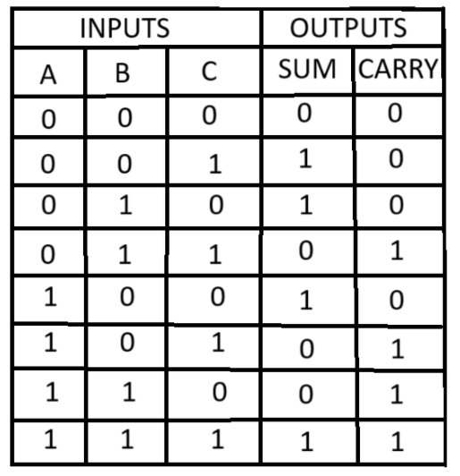
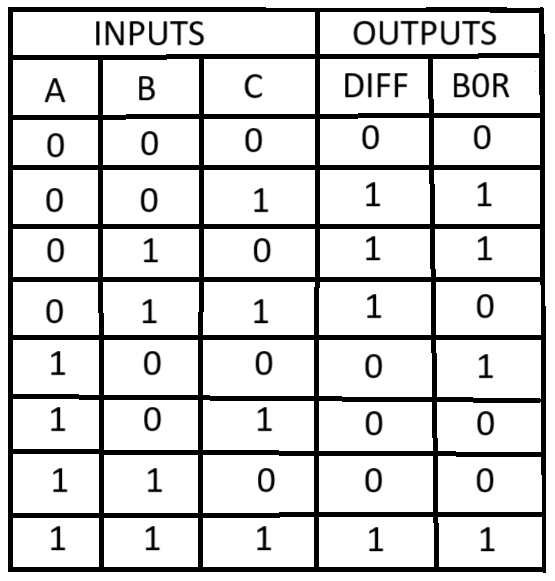

### Register number : 24900880
### Name : Abishek Priyan M
### Experiment 4: IMPLEMENTATION OF FULL ADDER SUBTRACTOR

Implementation-of-Full-Adder-and-Full-subtractor-circuit

**AIM:**

To design a Full Adder and Full Subtractor circuit and verify its truth table in Quartus using Verilog programming.

**Equipments Required:**

Hardware – PCs, Cyclone II , USB flasher

Software – Quartus prime

**Full Adder and Full Subtractor**

**Full Adder**

Full adder is a digital circuit used to calculate the sum of three binary bits. It consists of three inputs and two outputs. Two of the input variables, denoted by A and B, represent the two significant bits to be added. The third input, Cin, represents the carry from the previous lower significant position. Two outputs are necessary because the arithmetic sum of three binary digits ranges in value from 0 to 3, and binary 2 or 3 needs two digits. The two outputs are sum and carry.

Sum =A’B’Cin + A’BCin’ + ABCin + AB’Cin’ = A ⊕ B ⊕ Cin 

Carry = AB + ACin + BCin

**Figure -1 FULL ADDER**

**Full Subtractor**

A full subtractor is a combinational circuit that performs subtraction involving three bits, namely minuend, subtrahend, and borrow-in . It accepts three inputs: minuend, subtrahend and a borrow bit and it produces two outputs: difference and borrow.

Diff = A ⊕ B ⊕ Bin 

Borrow out = A'Bin + A'B + BBin

**Truthtable**

Full Adder Truth table

Full Subtracter Truth table

**Procedure**

**For Full Adder**

1. Open Quartus II and create a new project. 
2. Use schematic design entry to draw the full adder circuit.
3. The circuit consists of XOR, AND, and OR gates. 
4. Compile the design, verify its functionality through simulation.
5. Implement the design on the target device and program it.

**For Full Subtractor**

1. Follow the same steps as for the full adder.
2. Draw the full subtractor circuit using schematic design.
3. The circuit includes XOR, AND, OR gates to perform subtraction.
4. Compile, simulate, implement, and program the design similarly to the full adder.
5. Implement the design on the target device and program it.
   
**Program:**

**RTL Schematic**

**Output Timing Waveform**

**Result:**

Thus the Full Adder and Full Subtractor circuits are designed and the truth tables is verified using Quartus software.

